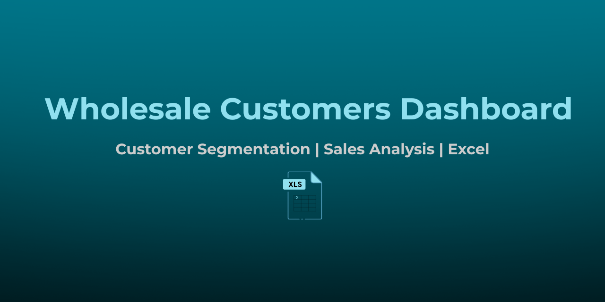
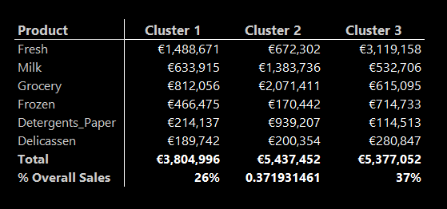
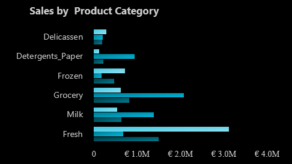
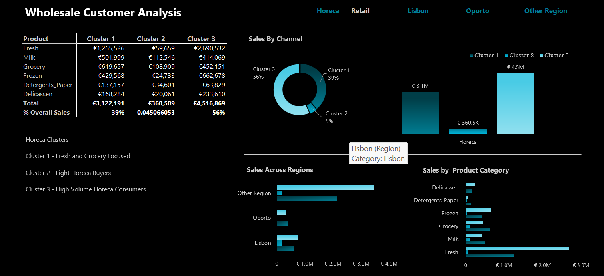
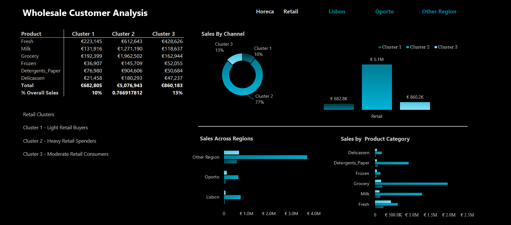
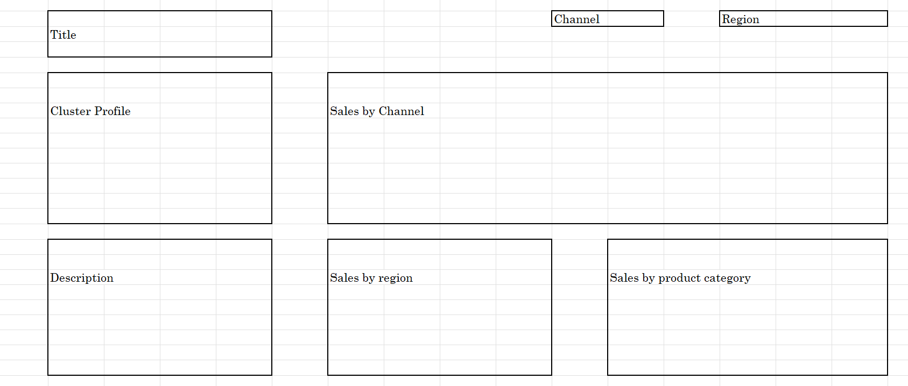

  

# Wholesale_Customers_Dashboard
Customer segmentation and sales analysis project using Excel
This project analyzes customer purchasing behaviour using the [Wholesale Customers Dataset](https://archive.ics.uci.edu/dataset/292/wholesale+customers) from the UCI Machine Learning Repository.

The goal was to segment customers based on their annual spending across six product categories and to build an interactive Excel dashboard highlighting sales patterns, regional differences, and cluster profiles for the Horeca and Retail channels.

The dashboard was developed using Microsoft Excel, PivotTables, Slicers, Solver, and advanced visualization techniques.

---

## 📈 Dataset Description
The dataset contains 441 observations of customers for a wholesale distributor. It includes:
- Annual spending in six product categories: Fresh, Milk, Grocery, Frozen, Detergents_Paper, and Delicassen
- Channel: Horeca (Hotel/Restaurant/Café) or Retail
- Region: Lisbon, Oporto, or Other Region

---

## 📂 Dataset Source
The data used in this project is the [Wholesale Customers Dataset](https://archive.ics.uci.edu/dataset/292/wholesale+customers) from the UCI Machine Learning Repository.

---

## 📊 Project Approach

### 🛠 Data Cleaning and Preparation
- Loaded the dataset into Power Query and cleaned it (corrected data types).
- Replaced coded numerical values for Channel and Region with readable names.
- Verified no missing values or duplicates.
- Converted data into an Excel Table to ensure dynamic updates across PivotTables.

### 🧠 Customer Segmentation
- Standardized the spending values using the Z-score method.
- Manually implemented K-Means clustering with 3 clusters:
  - Selected random initial cluster centres.
  - Calculated Euclidean distances between customers and cluster centres.
  - Assigned customers to the nearest cluster.
  - Optimized cluster centres using Excel Solver (GRG Nonlinear) to minimize total distance.

### 📈 Dashboard Development
- Created PivotTables summarizing sales by:
  - Product Category
  - Channel (Horeca/Retail)
  - Region (Lisbon, Oporto, Other Region)
- Designed interactive visualizations:
  - Clustered Bar Chart (Sales by Product Category)
  - Clustered Bar Chart (Sales across Regions)
  - Clustered Column Chart (Sales by Channel)
  - Pie Chart (Percentage of Total Sales by Clusters)
- Built a Cluster Profile Table and Dynamic Cluster Descriptions powered by slicers and helper tables.

---

## 🎨 Visual Design
- **Background:** Black
- **Primary Theme Colors:** Teal–Aqua Gradient (`#007C91` → `#00B4D8` → `#90E0EF`)
- **Axis Values:** Light Gray (`#CCCCCC`)
- **Titles and Labels:** White and Light Gray accents
- **Dashboard Footer:** "🔒 Dashboard protected — Use slicers to explore"

---

## 🚧 Challenges and Solutions
- **Handling REF Errors:** Used `IFERROR` to replace missing clusters during slicer filtering.
- **Fixing DIV/0 Errors:** Dynamically adjusted % Overall Sales calculations based on visible clusters.
- **Dynamic Textbox for Cluster Descriptions:** Created a formula-driven textbox that updates based on slicer selections.

---

## 📌 Key Insights
- Horeca customers, especially in Cluster 3, show a strong preference for Fresh products.
- Retail customers in Cluster 2 drive high sales in Grocery, Milk, and Detergents_Paper.
- Spending behaviours vary significantly across Lisbon, Oporto, and Other Regions.

---

## 📥 How to View the Dashboard
- Download the Excel file from this repository.
- Open it in Microsoft Excel (recommended: Excel 2016 or later).
- Use the slicers to explore sales clusters dynamically by channel and region.

---

## 🛠 Tools Used
- Microsoft Excel
  - Power Query
  - PivotTables
  - Solver (K-Means Optimization)
  - Slicers and Dynamic Textboxes
- Canva (for dashboard banner image design)

---

## 📸 Dashboard Previews

### Full Dashboard

### Cluster Profile Table

### Sales by Product Chart

### Horeca Slicer Option

### Retail Slicer Selection

### Dashboard Wireframe

---

## 👩‍💻 Author
- Oluwajomiloju Porter
- Data Analyst passionate about Sales Analytics, Customer Insights, and Financial Technology

---
